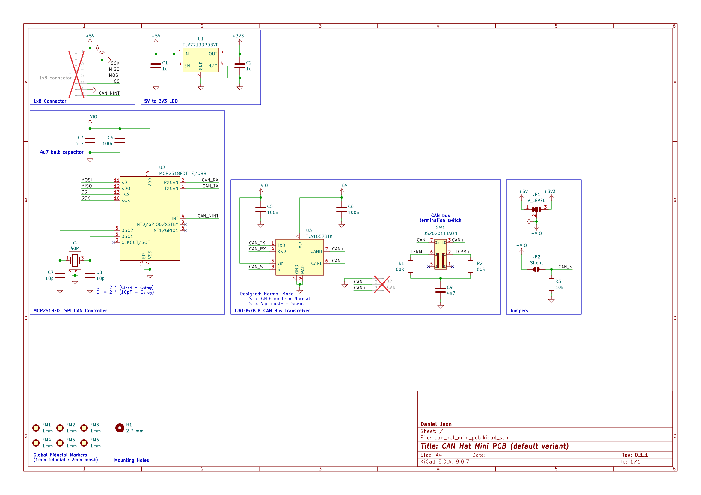

---

## 1 Overview

### 1.1 Bill of Materials (BOM)

| Manufacturer Part Number | Manufacturer         | Description                   | Quantity | Notes |
|--------------------------|----------------------|-------------------------------|---------:|-------|
| MCP2518FDT-E/QBB         | Microchip Technology | CAN FD to SPI Controller      |        1 |       |
| TJA1057BTK               | NXP USA Inc.         | CAN Bus Transceiver           |        1 |       |
| JS202011JAQN             | C&K                  | DPDT Slide Switch Right Angle |        1 |       |
| ECS-400-10-37B2-CKY-TR   | ECS Inc.             | 40 MHz crystal                |        1 |       |

---

## 2 Board Specifications

### 2.1 Connectors

Connectors fixed by hardware (PCB traces or the connector itself).

| Connector | Ref | Description                                                                                    |
|-----------|:---:|------------------------------------------------------------------------------------------------|
| `8-pin`   | J1  | Pin 1: 5V, Pin 2: GND, Pin 3: SCK, Pin 4: CIPO, Pin 5: COPI, Pin 6: CS, Pin 7: GND, Pin 8: INT |
| `CAN`     | J2  | Pin 1: ground, Pin 2: CAN high, Pin 3: CAN low                                                 |

### 2.2 Switches & Jumpers

User controllable hardware and/or firmware driven inputs.

| Switch/Jumper     | Ref | Description                                         |
|-------------------|:---:|-----------------------------------------------------|
| `CAN termination` | SW1 | 1 + 2 = No termination, 2 + 3 = 120 Ohm termination |
| `V IO`            | JP1 | 1 + 2 closed = 5 V, 2 + 3 closed = 3.3 V            |
| `CAN silent`      | JP2 | Open = normal operation, closed = silent mode       |

---

## 3 Schematics

Download
PDF: [can_hat_mini_pcb-schematic.pdf](assets/can_hat_mini_pcb-schematic.pdf).

---

## 4 CAD 3D Model

Download STEP file: [can_hat_mini_pcb-3D.step](assets/can_hat_mini_pcb-3D.step).
